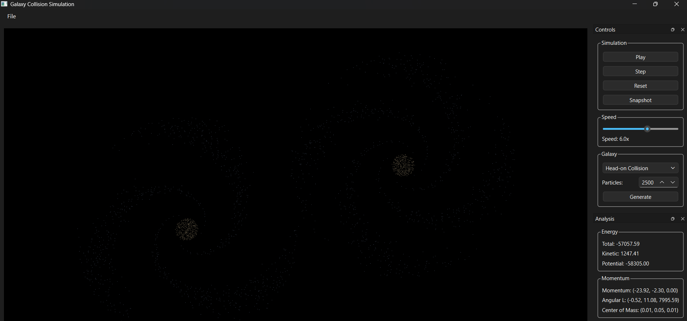
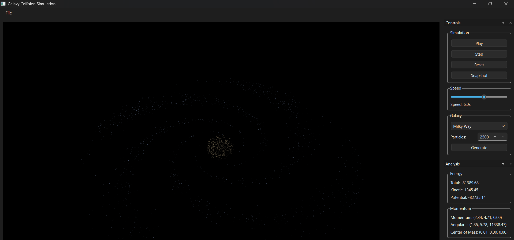

# Galaxy Collision Simulation

A scientifically plausible, GPU-accelerated visualization of two colliding galaxies with interactive controls. Built with Python, NumPy, and OpenGL/vispy for real-time rendering.

## Features

### Physics Engine
- **Newtonian Gravity**: Accurate N-body gravitational force calculation
- **Barnes-Hut Octree**: O(N log N) acceleration for large particle counts
- **Softening Parameter**: Prevents singularities during close encounters
- **Leapfrog Integrator**: Symplectic integration with excellent energy conservation
- **Adaptive Timestep**: Automatically adjusts based on particle proximity

### Galaxy Generation
- **Procedural Spiral Galaxies**: Generate realistic spiral galaxies
- **Configurable Parameters**: Number of arms, bulge radius, disk radius, rotation velocity, mass distribution, dark matter halo
- **Presets**: Milky Way and Andromeda configurations
- **Random Generation**: Create varied galaxies automatically

### Serialization
- **Save/Load**: Save and load simulation state to JSON
- **Galaxy Parameters**: Save and load galaxy configurations

## Installation

```bash
# Install dependencies
pip install -r requirements.txt

# Install package in editable mode
pip install -e .
```

## Requirements

- Python 3.9+
- NumPy >= 1.24.0, <2.0 (for CuPy compatibility)
- PyQt6 >= 6.4.0
- PyOpenGL >= 3.1.6
- vispy >= 0.9.5
- pytest >= 7.4.0 (for testing)
- cupy-cuda11x >= 13.0.0 (optional, for GPU acceleration - requires CUDA 11.x)

## Physics Implementation

### Newtonian Gravity

The gravitational force between two particles is calculated using:

```
F = G * m1 * m2 / (r^2 + ε^2)^(3/2) * r_vec
```

Where:
- G is the gravitational constant (default 1.0 in simulation units)
- m1, m2 are particle masses
- r is the distance between particles
- ε is the softening parameter to prevent singularities

### Barnes-Hut Algorithm

The Barnes-Hut algorithm accelerates N-body simulations from O(N²) to O(N log N) by:

1. Partitioning space into an octree
2. Computing total mass and center of mass for each node
3. Using the opening angle parameter θ to decide whether to:
   - Treat a node as a single mass (if θ > size/distance)
   - Recurse into child nodes (if θ ≤ size/distance)

### Leapfrog Integration

The leapfrog (kick-drift-kick) integrator provides excellent energy conservation:

```
v(t + dt/2) = v(t) + a(t) * dt/2
r(t + dt) = r(t) + v(t + dt/2) * dt
v(t + dt) = v(t + dt/2) + a(t + dt) * dt/2
```

This symplectic integrator conserves energy to within 1% over 1000 steps.

## Usage

### Running the GUI

```bash
python run_simulation.py
```

This launches the interactive GUI with:
- Galaxy generation controls (type, particle count)
- Simulation controls (Play/Pause, Step, Reset, Snapshot)
- Real-time analysis panel (energy, momentum, angular momentum, center of mass)
- FPS counter for performance monitoring

### Screenshots





### Basic Galaxy Generation

```python
from galaxy.spiral_generator import SpiralGalaxyGenerator, GalaxyParameters

# Create generator
generator = SpiralGalaxyGenerator()

# Generate a galaxy with custom parameters
params = GalaxyParameters(
    num_arms=4,
    bulge_radius=1.5,
    disk_radius=15.0,
    num_particles=2000
)
particles = generator.generate(params)

# Or use a preset
particles = generator.generate(SpiralGalaxyGenerator.MILKY_WAY)
```

### Running a Simulation (Programmatic)

```python
from physics.particle import Particle
from physics.integrator import LeapfrogIntegrator
from physics.barnes_hut import BarnesHutTree

# Create particles
particles = generator.generate(params)

# Set up integrator (fixed timestep for performance)
integrator = LeapfrogIntegrator(dt=0.01, adaptive=False, G=1.0, softening=0.1)

# Set up Barnes-Hut tree for acceleration (theta=0.8 for speed)
tree = BarnesHutTree(theta=0.8, softening=0.1, G=1.0)

# Run simulation
for step in range(1000):
    tree.build(particles)
    integrator.step(particles, use_barnes_hut=True, barnes_hut_tree=tree)
```

### Computing Analysis Metrics

```python
from physics.gravity import (
    compute_total_energy,
    compute_kinetic_energy,
    compute_potential_energy,
    compute_momentum,
    compute_angular_momentum,
    compute_center_of_mass
)

# Compute energy
total_energy = compute_total_energy(particles, softening=0.1, G=1.0)
kinetic_energy = compute_kinetic_energy(particles)
potential_energy = compute_potential_energy(particles, softening=0.1, G=1.0)

# Compute momentum
momentum = compute_momentum(particles)
angular_momentum = compute_angular_momentum(particles)

# Compute center of mass
com = compute_center_of_mass(particles)
```

### Saving and Loading

```python
from serialization import SimulationState, save_simulation, load_simulation

# Save simulation state
state = SimulationState(
    particles=particles,
    galaxy_params=params,
    simulation_settings={'dt': 0.01, 'G': 1.0}
)
save_simulation(state, 'simulation.json')

# Load simulation state
loaded_state = load_simulation('simulation.json')
particles = loaded_state.particles
```

## Testing

Run the test suite:

```bash
pytest tests/ -v
```

The test suite includes:
- Particle structure validation
- Gravity force calculation accuracy
- Barnes-Hut octree construction and accuracy
- Leapfrog integrator energy conservation
- Galaxy generation validation
- Serialization correctness

## Architecture

```
galaxy-collision-sim/
├── src/
│   ├── physics/          # Physics engine
│   │   ├── particle.py      # Particle class
│   │   ├── gravity.py       # Newtonian gravity calculations
│   │   ├── gravity_gpu.py   # GPU-accelerated gravity (CuPy)
│   │   ├── barnes_hut.py    # Barnes-Hut octree
│   │   └── integrator.py    # Leapfrog integrator
│   ├── galaxy/           # Galaxy generation
│   │   ├── spiral_generator.py
│   │   └── collision_presets.py
│   ├── renderer/         # Rendering engine
│   │   └── opengl_renderer.py  # vispy GPU-accelerated renderer
│   ├── ui/               # User interface
│   │   └── main_window.py     # PyQt6 main window
│   └── serialization.py  # Save/load functionality
├── tests/               # Test suite
├── run_simulation.py    # GUI entry point
└── requirements.txt     # Dependencies
```

## Performance

Current configuration (CPU Barnes-Hut + GPU rendering):
- **2,000 particles**: ~10-20 FPS (Barnes-Hut theta=0.8, vispy rendering)
- **5,000 particles**: ~5-10 FPS (Barnes-Hut theta=0.8, vispy rendering)

Performance scales as O(N log N) with the Barnes-Hut algorithm, compared to O(N²) for direct summation. GPU rendering via vispy provides significant acceleration for visualization.

**Optimization Notes:**
- Barnes-Hut theta=0.8 provides faster performance with acceptable accuracy
- Fixed timestep (dt=0.01) disabled adaptive timestep for performance
- vispy GPU rendering handles particle visualization efficiently
- Analysis updates disabled during simulation for performance

## Current Status (LoopSpec v3 - Iteration 9)

### Completed
- ✅ Physics engine (Newtonian gravity, Barnes-Hut octree, softening)
- ✅ Leapfrog integrator with fixed timestep (adaptive disabled for performance)
- ✅ Particle system with position, velocity, mass, color, radius
- ✅ Procedural spiral galaxy generator with configurable parameters
- ✅ Milky Way, Andromeda, Head-on Collision, Fly-by Collision presets
- ✅ Random galaxy generation
- ✅ Serialization (save/load to JSON)
- ✅ PyQt6 GUI with interactive controls
- ✅ vispy GPU-accelerated rendering (OpenGL)
- ✅ Barnes-Hut octree optimization (theta=0.8 for performance)
- ✅ Real-time analysis panel (energy, momentum, angular momentum, center of mass)
- ✅ Simulation controls (Play/Pause, Step, Reset, Snapshot)
- ✅ Snapshot export (PNG)
- ✅ FPS counter and performance monitoring
- ✅ Comprehensive test suite (26 tests passing)

### Known Issues
- ⚠️ GPU gravity acceleration (CuPy) disabled due to CUDA library incompatibility
- ⚠️ Using CPU Barnes-Hut for physics (still O(N log N) performance)
- ⚠️ Performance with 2000+ particles needs further optimization

### Future Improvements
- ⏳ Fix CuPy CUDA library compatibility for GPU gravity
- ⏳ Implement GPU compute shaders for physics
- ⏳ Further Barnes-Hut optimization
- ⏳ Camera controls (zoom, pan, orbit)
- ⏳ Advanced visualization modes (density, velocity, potential fields)
- ⏳ Export features (GIF, MP4)
- ⏳ Multithreading for CPU parallelization

## License

MIT License

## Contributing

This project follows the LoopSpec v3 protocol for structured development. See `.loopspec/` directory for protocol details.
